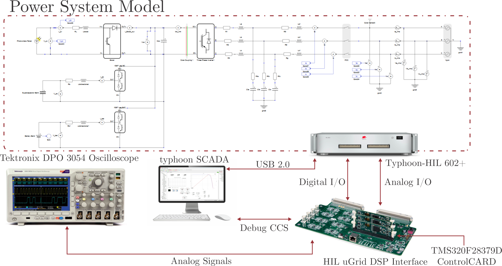

# Minimization of intermittency in photovoltaic generation using Hybrid Energy Storage System
## Master's degree project.

Development of a three-phase inverter for PV generation with a Hybrid Energy Storage System (HESS), integrating lithium-ion battery pack and a supercapacitor (SC) pack. The Energy Management System (EMS) employs fuzzy logic control to optimize resource utilization. The resulting power dispatch follows the moving average of PV generation to mitigate intermittencies.

The code is designed for the Delfino F28379D controlCARD (TMDSCNCD28379D) from Texas Instruments. This controlCARD is mounted on the HIL Launchpad Interface, which provides a pin-to-pin compatible connection between Typhoon HIL emulators and C2000 series LaunchPads.

In Typhoon HIL, the PV panel, power converters and energy storage elements are emulated, enabling the validation of the control logic running on the microcontroller.
Analog outputs are generated through the HIL Launchpad Interface, and voltage and current signals are analyzed using an oscilloscope.

Typhoon files:
  - Typhoon schematic: PV3phGrid_uc.tse
  - SCADA model: pv3phGrid_panel.cus
  - SCADA model settings: pv3phGrid_uc_model.runx
 
  Code Composer Studio
 Version: 10.4.0.00006 
